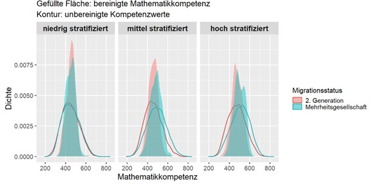

```{=html}
<div class="project-grid">

  <!-- 2025 · PISA -->
  <div class="card project-card">
    
    <div class="card-body">
      <h5 class="card-title">Stratifizierung und ethnische Bildungsungleichheit</h5>
      <p class="card-text">
        analysiert anhand von PISA-2022-Daten, wie Bildungssysteme ethnische Leistungsunterschiede prägen.
Zeigt, dass stärkere Stratifizierung Effizienz steigert, aber Chancengleichheit mindert.
      </p>
      <div class="proj-meta">
        <span class="badge bg-light text-dark">HLM (3-Level)</span>
        <span class="badge bg-light text-dark">PISA 2022</span>
        <span class="badge bg-light text-dark">Migration</span>
        <span class="badge bg-light text-dark">Bildungsungleichheit</span>
      </div>
      <a href="files/papers/ethnic-penalties-pisa.pdf"
         class="stretched-link" target="_blank" rel="noopener"
         aria-label="PDF: PISA 2022 – Stratifizierung & Ethnic Penalties"></a>
    </div>
  </div>

  <!-- 2025 · AfD/TikTok -->
  <div class="card project-card">
    
    <div class="card-body">
      <h5 class="card-title">Plattformlogiken & kritische Massen: AfD auf TikTok</h5>
      <p class="card-text">
        untersucht den digitalen Aufstieg der AfD auf TikTok mit Theorien kollektiver Dynamiken.
Erklärt, wie algorithmische Logiken und Emotionen digitale Massen mobilisieren.
      </p>
      <div class="proj-meta">
        <span class="badge bg-light text-dark">Plattformlogik</span>
        <span class="badge bg-light text-dark">Kritische Massen</span>
        <span class="badge bg-light text-dark">Digitaler Populismus</span>
      </div>
      <a href="files/papers/afd-tiktok-kritische-massen.pdf"
         class="stretched-link" target="_blank" rel="noopener"
         aria-label="PDF: AfD auf TikTok – kritische Massen"></a>
    </div>
  </div>

</div>
```